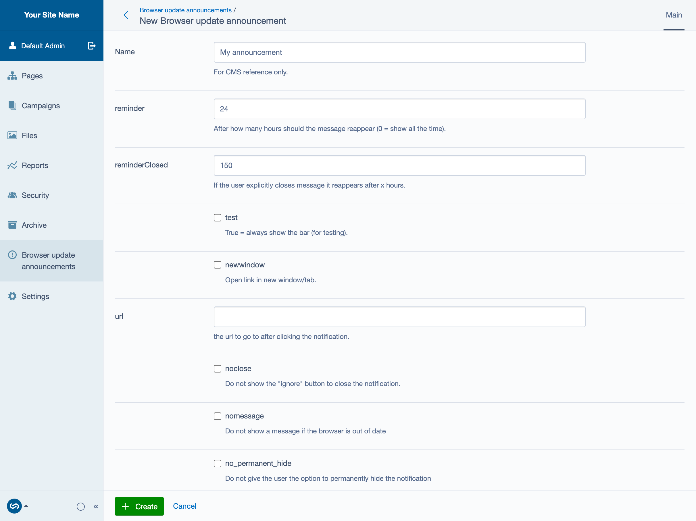
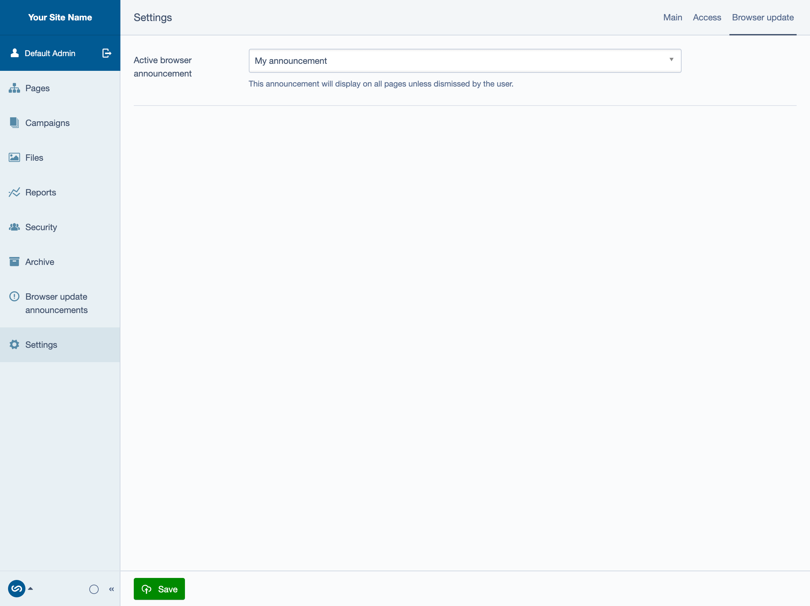
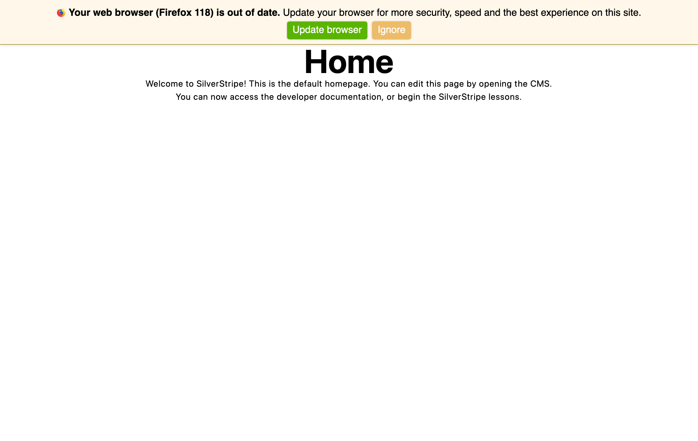
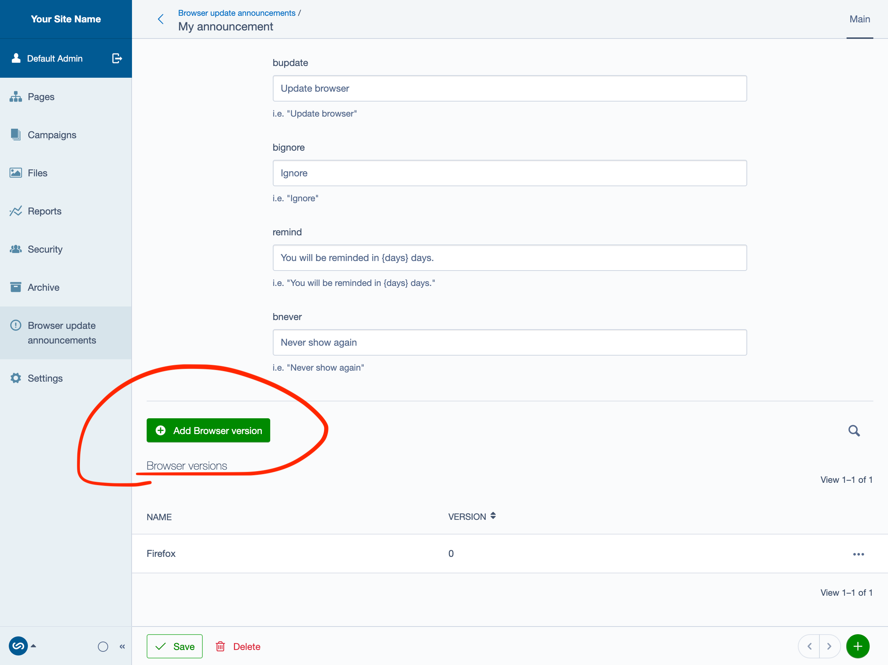
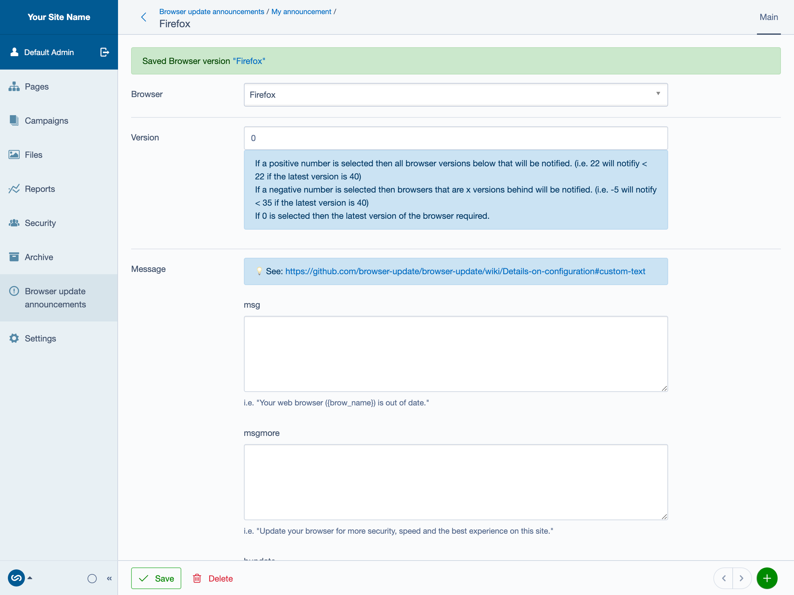

# Silverstripe Browser Update

[Browser update](https://browser-update.org/) integration for Silverstripe CMS.

## Installation 👷‍♀️

Install via composer.

```sh
composer require dnadesign/silverstripe-browser-update
```

Rebuild your application.

```sh
vendor/bin/sake dev/build flush=1
```

## Configuration 🚧

Add the `$BrowserUpdate` function to anywhere in your page body.

```diff
<body>
+{$BrowserUpdate}
...
</body>
```

## Usage 🤔

### Creating a browser update announcement ➕
Navigate to `/admin/browser-update-announcements` to add a new announcement.

This page contains 'global' settings that will affect all announcements on all browsers. By default, all insecure and unsupported browsers will be notified. All full reference for the settings can be found [here](https://browser-update.org/customize.html).



### Activating the browser update announcement 🚨

To activate the announcement, it must be set as active in `/admin/settings`.



Now navigate to the frontend of your site, if your browser is insecure or unsupported, you should recieve a notification.



## Targeting specific browsers 🎯

In order to target a specific browser you can add a 'browser version'.



From here you can select a browser, select the version constraints, and customise the message that the users will recieve. If the message fields are left empty, then they will default back to the global settings.


